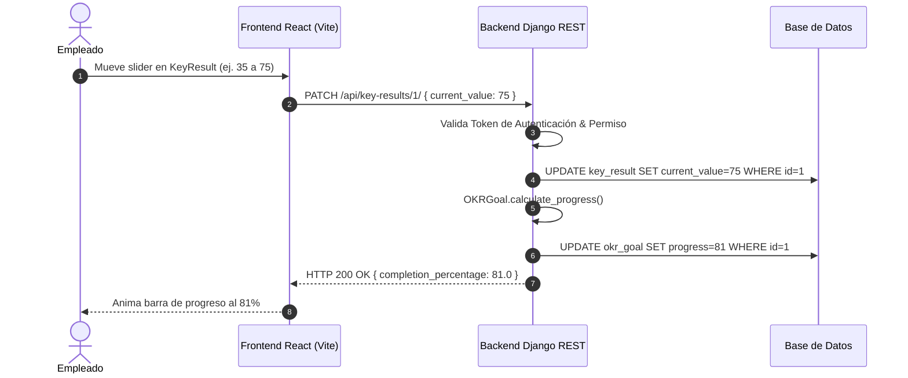

# MEMORIA TÉCNICA DEL PROYECTO FINAL DE MÁSTER

---

**MÁSTER EN DESARROLLO FULL STACK**  
**Conquer Blocks**  

**Título del Proyecto:** TalentPulse – Plataforma de Gestión del Talento, Evaluaciones 360° y Objetivos (OKR,s)  
**Alumna:** Iris Chacón Romero  
**Fecha:** Septiembre 2026  
**Tecnologías:** Django 5, Django REST Framework, React 18, Vite, SQLite/PostgreSQL, Docker  

---

## 📑 ÍNDICE DE CONTENIDOS
1. [1. Definición del problema](#1-definición-del-problema)
2. [2. Reflexión: aportación y eficiencia](#2-reflexión-aportación-y-eficiencia)
3. [3. Listado de tecnologías utilizadas](#3-listado-de-tecnologías-utilizadas)
4. [4. Definición de tipos de usuarios](#4-definición-de-tipos-de-usuarios)
5. [5. Casos de uso](#5-casos-de-uso)
6. [6. Seguridad y protección de datos](#6-seguridad-y-protección-de-datos)
7. [Anexo: Guía de Instalación y Despliegue](#anexo-guía-de-instalación-y-despliegue)

---

## 1. Definición del problema

### Contexto
En el ámbito empresarial actual, la gestión continua del talento y el seguimiento transparente de los objetivos estratégicos (OKRs) son factores determinantes para el rendimiento organizativo. No obstante, en un alto porcentaje de pequeñas y medianas empresas, estos procesos se ejecutan de manera manual, utilizando plantillas de hojas de cálculo desconectadas o comunicaciones dispersas por correo electrónico.

### Carencias detectadas
- **Falta de visibilidad ejecutiva:** Los objetivos trimestrales (OKRs) residen en documentos locales no sincronizados, lo que impide a los responsables conocer el porcentaje real de avance de la compañía.
- **Ciclos de evaluación lentos y burocráticos:** Las evaluaciones de desempeño anuales o semestrales requieren semanas de recopilación de formularios manuales.
- **Ausencia de feedback continuo:** Los colaboradores reciben retroalimentación con meses de retraso, impidiendo corregir desviaciones a tiempo o reconocer logros oportunamente.

### Impacto
Esta desconexión genera desalineación estratégica, pérdida de tiempo operativo en Recursos Humanos y desmotivación en los empleados por la falta de reconocimiento continuo.

### Solución propuesta: TalentPulse
**TalentPulse** es una aplicación web Full Stack que centraliza en una única plataforma accesible y moderna:
- **Gestión de Objetivos OKRs:** Actualización de métricas en tiempo real con recálculo automático de porcentajes de progreso y estados (`IN_PROGRESS`, `COMPLETED`, `AT_RISK`).
- **Evaluaciones de Desempeño 360°:** Valoración de competencias cuantitativas (Liderazgo, Trabajo en Equipo, Habilidades Técnicas) con notas ponderadas y campos cualitativos.
- **Feedback Continuo:** Muro de reconocimientos directo con opción de mensajes públicos o anónimos.
- **Dashboard Ejecutivo:** Tablero de analítica consolidada por departamento mediante endpoints REST agregados.

---

## 2. Reflexión: aportación y eficiencia

### Aportación al proceso empresarial
TalentPulse transforma un flujo analógico y disperso en un proceso digital centralizado. Las principales mejoras en los procesos son:

1. **Automatización del cálculo de OKRs:** Al actualizar el valor actual de un resultado clave (`KeyResult`), el sistema ejecuta automáticamente la función `calculate_progress()` en el ORM de Django, actualizando la ponderación global del objetivo sin intervención humana.
2. **Consolidación de notas 360°:** El modelo `PerformanceReview` pondera automáticamente las calificaciones de competencias al momento de guardar.
3. **Agregación analítica en tiempo real:** Los responsables acceden instantáneamente al porcentaje medio de avance por departamento mediante consultas optimizadas con `Count` y `Avg` de Django.

### Análisis cuantitativo de eficiencia

| Proceso | Método Tradicional (Excel/Email) | Con TalentPulse | Ganancia de Eficiencia |
| :--- | :--- | :--- | :--- |
| Recopilación de Evaluaciones 360° | 2 a 3 semanas de trabajo manual | Inmediata tras aprobación digital | **85% de ahorro de tiempo** |
| Recálculo de Progreso de Objetivos | Manual semanal (aprox. 5h/mes) | Automático instantáneo en BD | **100% de automatización** |
| Notificación de Feedback | Anual / Semestral | En tiempo real en 3 clics | **Mayor compromiso del equipo** |

---

## 3. Listado de tecnologías utilizadas

### Backend (Django & API REST)
- **Django 5.x & Python 3.13:** Utilizado como motor backend principal. Proporciona una arquitectura robusta, ORM avanzado con protección ante inyecciones y panel de administración nativo.
- **Django REST Framework (DRF):** Permite construir una arquitectura API RESTful desacoplada con ViewSets, paginación (`PageNumberPagination`) y serializadores fuertemente tipados.
- **Custom User Model (`AbstractUser`):** Modelo de usuario personalizado que añade los campos de negocio `role` (`ADMIN`, `MANAGER`, `EMPLOYEE`), `department`, `job_title` y `avatar_url`.
- **django-cors-headers:** Middleware para la gestión segura de peticiones Cross-Origin entre React y Django.
- **Base de datos:** SQLite en entorno de desarrollo local y PostgreSQL configurado para entorno de producción.

### Frontend (React SPA)
- **React 18 & Vite 6:** Utilizados para desarrollar una aplicación web de página única (SPA) modular, rápida y libre de recargas molestas de página.
- **Axios:** Cliente HTTP configurado con interceptores para inyectar automáticamente el token de autenticación (`Token <token>`) en cada cabecera.
- **Context API (`AuthContext`):** Gestión del estado global de autenticación, control de rutas protegidas y persistencia en `localStorage`.
- **CSS3 Vanilla (Glassmorphic Design):** Diseño de interfaz moderno con variables CSS, transparencias, gradientes y diseño totalmente responsivo.

### DevOps y Despliegue
- **Git & GitHub:** Control de versiones con historial de commits limpios y estructurados.
- **Docker & Docker Compose:** Contenerización para garantizar la portabilidad total de la aplicación.
- **Render.com / Railway:** Despliegue mediante archivo de configuración `render.yaml` y script `build.sh`.

---

## 4. Definición de tipos de usuarios

Se implementó un sistema estricto de **Control de Acceso Basado en Roles (RBAC)**:

### Matriz de Roles y Permisos

| Rol | Descripción | Acciones Permitidas |
| :--- | :--- | :--- |
| **Administrador / CTO** | Usuario con control total sobre la plataforma. | Crear y gestionar usuarios, departamentos, acceder al Dashboard Ejecutivo global y supervisar todas las evaluaciones y OKRs. |
| **Manager / Supervisor** | Responsable de equipo o departamento. | Acceder al Dashboard Ejecutivo de su departamento, crear y aprobar Evaluaciones 360° para sus colaboradores y supervisar OKRs de equipo. |
| **Empleado** | Usuario colaborador de la empresa. | Ver y actualizar el avance de sus OKRs personales mediante sliders interactivos, consultar sus evaluaciones recibidas y enviar feedback a compañeros. |
| **Visitante / Anónimo** | Usuario no autenticado. | Únicamente puede visualizar la pantalla de inicio de sesión (`/login`). Cualquier otro acceso redirige automáticamente a la autenticación. |

---

## 5. Casos de uso

### Caso de Uso 1: Autenticación de Usuario (UC-01)
- **Actor:** Todos los tipos de usuario.
- **Flujo Principal:**
  1. El usuario accede a la ruta `/login` e ingresa usuario y contraseña.
  2. El frontend realiza una petición `POST /api/auth/login/`.
  3. Django valida las credenciales y responde con HTTP 200 conteniendo el token de sesión y los datos del perfil.
  4. React guarda el token en `localStorage` y redirige al panel correspondiente según el rol.
- **Flujo de Error:** Si las credenciales son incorrectas, Django devuelve HTTP 401 y el frontend muestra un mensaje de error explícito.

### Caso de Uso 2: Actualización de Resultados Clave de OKR (UC-02)
- **Actor:** Empleado / Manager.
- **Flujo Principal:**
  1. El empleado ingresa a la pestaña "Mis OKRs & Objetivos".
  2. Modifica el valor de un slider en un resultado clave (`KeyResult`).
  3. React envía una petición `PATCH /api/key-results/{id}/`.
  4. Django actualiza el modelo en la base de datos y ejecuta la función de recálculo en el objetivo.
  5. La interfaz de React se actualiza en tiempo real mostrando el nuevo porcentaje global.



---

## 6. Seguridad y protección de datos

### Medidas de Seguridad Aplicadas
1. **Autenticación Segura y Hashing:** Las contraseñas se almacenan mediante el algoritmo **PBKDF2 con SHA256** propio de Django.
2. **Protección contra Inyección SQL:** El uso exclusivo del ORM de Django garantiza que todas las consultas SQL sean parametrizadas automáticamente.
3. **Protección XSS y CSRF:** React escapa automáticamente las variables en JSX previniendo inyección de scripts. El backend implementa cabeceras CORS restringidas mediante `django-cors-headers`.
4. **Gestión de Secretos:** La clave secreta (`SECRET_KEY`), variables de base de datos y credenciales se gestionan a través de variables de entorno (`.env`).
5. **Cumplimiento RGPD:** La aplicación soporta el derecho al olvido mediante la eliminación lógica/física de usuarios y la portabilidad de datos a través de exportación JSON en la API REST.

---

## Anexo: Guía de Instalación y Despliegue

### Ejecución Local
```bash
# 1. Clonar el repositorio
git clone https://github.com/IrisChaConRomero/TalentPulse.git
cd TalentPulse

# 2. Iniciar Backend Django
source backend/venv/bin/activate
cd backend
python manage.py migrate
python populate_db.py
python manage.py runserver

# 3. Iniciar Frontend React
cd ../frontend
npm install
npm run dev
```

---
*Memoria Técnica presentada para la evaluación del Proyecto Final de Máster en Desarrollo Full Stack (Conquer Blocks).*
